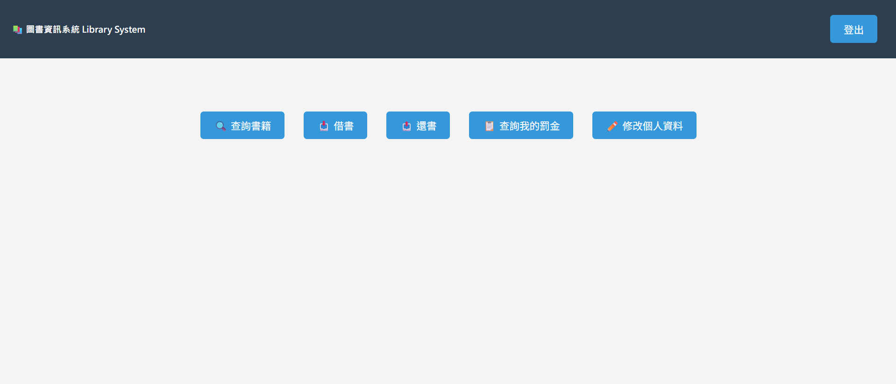
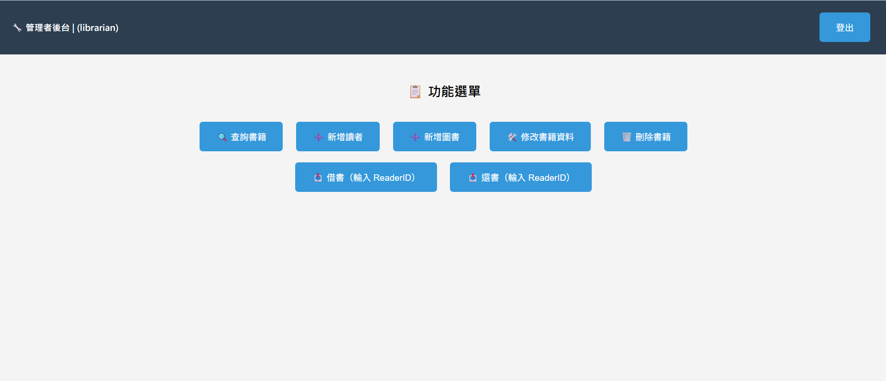
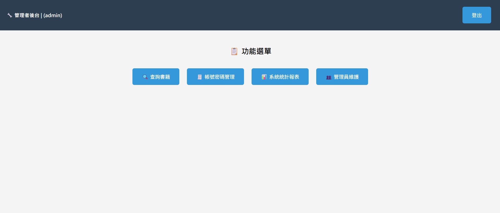
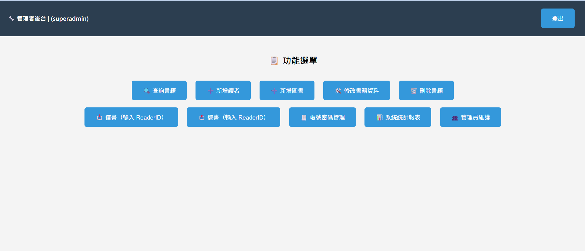

# Library Management System

A database-driven web application built with **PHP and MySQL** that simulates how a real library manages books, readers, and administrative operations.

This project was developed as my Database Management Systems final project.

The goal of this project was to **design a small library system that connects a database with a web interface, and allows different user roles to manage books and accounts**.

# Key Features

The system supports multiple user roles. Each role has different permissions and functions in the system.

## Reader
Readers are normal users of the library system and can:
- Search books in the library catalog
- Borrow available books
- Return borrowed books
- View fine records
- Edit personal information

## Librarian
Librarians are responsible for managing the library’s book inventory and helping readers with borrowing operations. They can:
- Add new books to the system
- Edit book information
- Delete books from the database
- Borrow books for readers
- Process book returns

## Admins
Admins are responsible for maintaining system data and managing user accounts. They can:
- Search books in the database
- Maintain book records
- Manage user accounts
- Perform basic system maintenance

## SuperAdmin 
SuperAdmin has the highest level of permission in the system and can control all system operations. They can:
- Manage administrator accounts
- Access all system functions
- View system statistics
- Perform full system management

# Technologies Used

This project was implemented using the following technologies:

- **PHP** – backend logic
- **MySQL** – relational database
- **XAMPP** – local development server
- **phpMyAdmin** – database management
- **HTML / CSS** – interface design
- **JavaScript** – basic UI interaction

# System Architecture

The system follows a simple web application architecture:

User Interface → PHP Backend → MySQL Database

Users interact with the web pages, PHP processes the requests, and MySQL stores the data.

# Database Design

The database was designed using:
- Entity Relationship Diagram (ERD)

- Logical Data Model
- Physical Data Model
- Database Normalization (up to 3NF)

# What I Learned

Through this project, I gained practical experience in:
- Designing relational database schemas
- Creating ER diagrams and normalized tables
- Implementing CRUD operations
- Connecting PHP with MySQL
- Managing user roles and permissions
- Building a multi-page web application
- Understanding how backend systems interact with databases

This project helped me better understand how database systems support real-world applications.

# How to Run the Project

If you want to run the project on your computer, you can follow these steps.

1. Install XAMPP.
2. Put the Library folder inside the htdocs folder.
3. Start Apache and MySQL in XAMPP.
4. Go to phpMyAdmin and import database/library.sql.
5. Then open the browser and go to:
http://localhost/Library/input002.php

# Project Structure

The repository is organized into several folders to separate source code, database files, diagrams, and documentation.

## Library
Contains the PHP source code of the system.

## database
Contains the SQL file used to create the MySQL database.

## diagrams
Contains the ER diagram and other database design diagrams.

## docs
Contains the final project report.

## screenshots
Contains screenshots of the system interfaces.

# System Screenshots

The screenshots folder contains multiple screenshots showing different parts of the system.

These include:
- Reader interfaces such as searching books, borrowing books, returning books, and viewing fine records.
- Librarian interfaces for managing books and assisting readers.
- Admin interfaces for system maintenance and account management.
- SuperAdmin interfaces for administrator management and system statistics.
